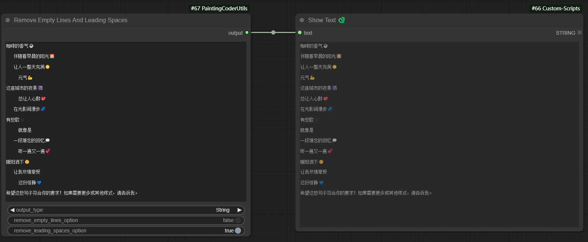

# ComfyUI画画的程序员工具集节点

一个喜欢画画的程序员设计的 ComfyUI 设计的实用节点集合，提供便捷的图像、文本处理工具。

[English](./README.md)

## 📦 安装方法

1. 进入 ComfyUI 的 `custom_nodes` 目录
2. 克隆仓库：
   ```bash
   cd custom_nodes
   git clone https://github.com/jammyfu/ComfyUI_PaintingCoderUtils.git
   ```
3. 重启 ComfyUI

## 🎯 功能节点

### 📐图像分辨率调整器 (Image Resolution Adjuster)
一个用于按照 SDXL 最佳宽高比调整图像分辨率的实用节点。


特点：
- 支持所有 SDXL 最佳分辨率：
  - 1:1 (1024x1024)
  - 9:7 (1152x896)
  - 7:9 (896x1152)
  - 3:2 (1216x832)
  - 2:3 (832x1216)
  - 7:4 (1344x768)
  - 4:7 (768x1344)
  - 12:5 (1536x640)
  - 5:12 (640x1536)
- 多种延展模式：
  - contain: 保持比例缩放至目标尺寸内
  - cover: 保持比例缩放以覆盖目标尺寸
  - fill: 拉伸以填充目标尺寸
  - inside: 类似 contain，但只缩小不放大
  - outside: 类似 cover，但只放大不缩小
  - top/bottom/left/right/center: 在目标尺寸内定位图像
- 可调节的缩放系数
- 可配置的最大和最小分辨率限制
- 背景颜色选择器
- 调整时保持宽高比
### 图像描边功能 (Image Outline)
在图像分辨率调整器中新增了描边功能：
- 一键添加 1 像素宽的描边
- 描边颜色自动设置为背景色的反色
- 适用于所有延展模式
- 保持图像质量不变
- 自动调整输出尺寸（每边增加 1 像素）

使用方法：
1. 将节点添加到工作流
2. 从 SDXL 预设中选择目标分辨率
3. 根据需要选择延展模式
4. 使用颜色选择器设置背景颜色
5. 根据需要调整缩放系数和分辨率限制
6. 在图像分辨率调整器中找到 `add_outline` 选项
7. 设置为 `True` 启用描边
8. 描边颜色会自动根据 `background_color` 设置的背景色计算反色
9. 输出图像尺寸会自动调整（宽高各增加 2 像素）

### ✂️空行和前导空格清理器 (Remove Empty Lines And Leading Spaces)
一个用于清理文本中的空行和前导/尾随空格的文本处理节点。

特点：
- 移除文本中的空行
- 移除行首和行尾的空格
- 可选择保留段落之间的单个空行
- 可选择保留缩进
- 支持批量文本处理

使用示例：
```
输入文本：
    你好世界    
  
     这是一个测试    
  
  
    上面有多个空行    

输出文本（使用默认设置）：
你好世界
这是一个测试
上面有多个空行
```

参数说明：
- `output type`：输出类型(文本、列表)
- `remove empty line option`：移除空行
- `remove loading space option`：移除空格

使用场景：
- 清理提示词文本
- 格式化 LoRA 训练文本
- 准备文生图的输入文本
- 标准化文本输入格式

清除多余的空行及空格生成文本：


清除空行保留空格生成文本：


清除空格保留空号生成文本：


清除空行、空格生成列表：


### 文本组合器（TextCombiner）
新增文本组合器节点，可以将多个文本输入组合成一个文本输出。

功能特点：
- 支持动态输入：连接输入时自动增加新的输入点
- 灵活的分隔符：
  - 支持正则表达式
  - 支持转义字符（如 \n, \r）
  - 留空则使用空格连接
- 智能换行：当分隔符包含换行符时，自动按行分割输出
- 自动过滤：移除空行，保留纯空格内容

使用示例：
1. 基本用法：
   - 使用逗号分隔：`,`
   - 输出：text1, text2, text3

2. 换行分隔：
   - 使用换行符：`\n`
   - 输出：
     ```
     text1
     text2
     text3
     ```

3. 混合分隔：
   - 使用逗号或换行：`,|\n`
   - 支持两种分隔方式

4. 空分隔符：
   - 留空
   - 直接用空格连接文本


### 🖼️动态图像输入组合器 (Dynamic Image Input)
一个用于动态组合多个图像输入的节点。

特点：
- 动态输入端口：连接时自动增加新的图像输入点
- 智能图像处理：
  - 自动过滤空输入
  - 保持图像格式和质量
  - 支持批量图像处理
- 错误处理：
  - 当没有有效输入时返回空白图像
  - 优雅处理异常情况
- 输出格式：返回图像列表，便于后续处理

使用方法：
1. 将节点添加到工作流
2. 连接图像输入（会自动创建新的输入端口）
3. 节点将自动组合所有非空图像输入
4. 输出可以连接到需要图像列表的其他节点

使用场景：
- 批量图像处理
- 图像集合管理
- 动态工作流构建
- 图像列表生成

## 📝 许可证

MIT License

## 🤝 更新说明
### v0.1.3 (2024-12-26)
- 新增动态图像输入组合器
  - 实现动态输入端口
  - 添加智能图像处理
  - 优化错误处理机制
  - 支持图像列表输出 


### v0.1.2 (2024-12-25)
- 新增图像描边功能
- 新增文本组合器节点 


### v0.1.1 (2024-12-25)
- 新增 TextCombiner 节点
  - 实现动态输入连接点
  - 支持正则表达式分隔符
  - 支持换行符和转义字符
  - 添加空分隔符处理
  - 优化文本拼接逻辑

### v0.1.0 (2024-12-23)
- 首次发布
- 添加图像分辨率调整器：
  - 支持 SDXL 最佳分辨率
  - 多种延展模式
  - 背景颜色选择器
  - 缩放系数调整
  - 分辨率限制
- 添加空行和前导空格清理器：
  - 文本清理功能
  - 可配置的保留选项
  - 批量处理支持

### 计划功能
- 动态图像输入组合
- 文本模板系统
- 更多图像处理工具

## 🤝 贡献

欢迎提交 Issue 和 Pull Request！

## 🙏 致谢

- ComfyUI 团队
- Impact-Pack 项目


这个 README：
